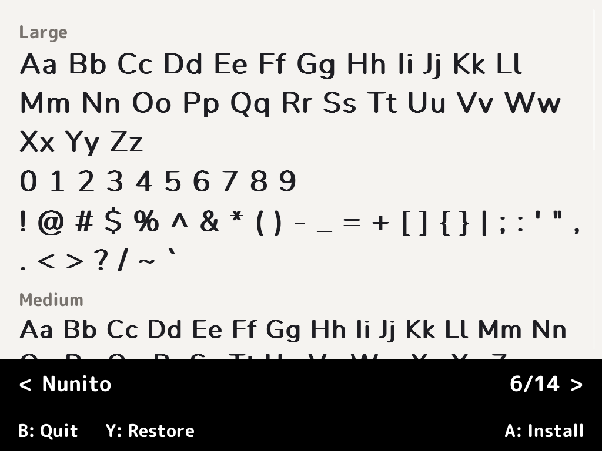
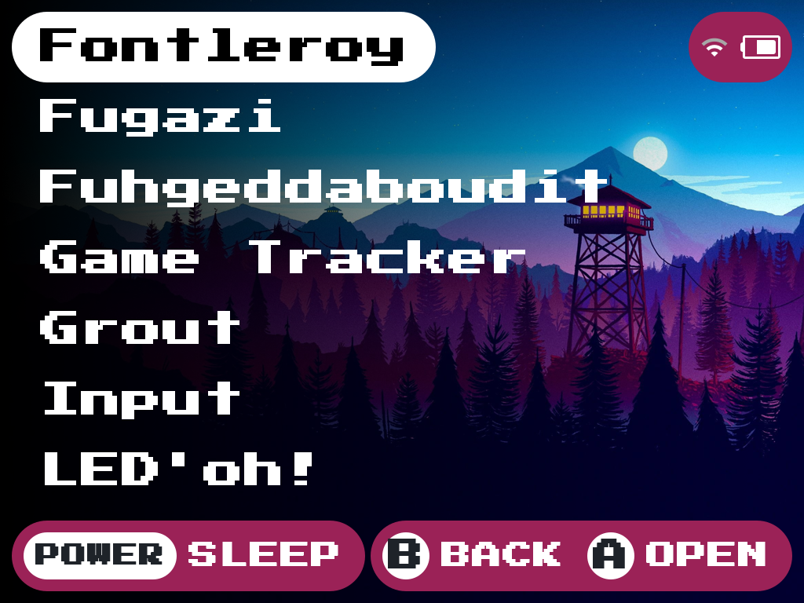

<div align="center">

# Fontleroy


[](https://github.com/ericreinsmidt/nextui-fontleroy/releases)
[](https://github.com/ericreinsmidt/nextui-fontleroy/releases)
[](LICENSE)

A font manager for [NextUI](https://github.com/LoveRetro/NextUI) on TrimUI handheld devices.

Built with [PakKit](https://github.com/ericreinsmidt/pakkit) and [Apostrophe](https://github.com/Helaas/Apostrophe).

</div>

## Features

- **14 bundled fonts** — Curated selection of free fonts ready to install
- **User font support** — Drop your own TTF files into the user fonts folder
- **Full-screen preview** — See how each font looks at all 5 NextUI text sizes (Large, Medium, Small, Tiny, Micro)
- **Exact system rendering** — Preview matches NextUI's actual font sizes and bold styling
- **Scrollable specimen** — Uppercase, lowercase, numbers, and symbols all visible
- **One-button install** — Writes font to both system font slots and quits for immediate effect
- **Safe backups** — Original system fonts backed up alongside the originals (survives app uninstall)
- **One-button restore** — Restore original system fonts at any time

## Screenshots

| Preview | Installed |
|---------|-----------|
|  |  |
| Font preview | Press Start 2P installed as system font |

## Controls

| Button | Action |
|--------|--------|
| Left/Right | Cycle through fonts |
| Up/Down | Scroll preview |
| A | Install selected font (confirms, then quits) |
| Y | Restore original fonts (confirms, then quits) |
| B | Quit |

## Bundled Fonts

| Font | Style |
|------|-------|
| Atkinson Hyperlegible | High-legibility sans-serif |
| Cabin | Humanist sans-serif |
| Exo 2 | Geometric sans-serif |
| JetBrains Mono | Monospace |
| Lexend | Reading-optimized sans-serif |
| Nunito | Rounded sans-serif |
| Orbitron | Geometric/futuristic |
| Outfit | Geometric sans-serif |
| Pixelify Sans | Pixel-style |
| Press Start 2P | Retro arcade |
| Quicksand | Rounded sans-serif |
| Rajdhani | Semi-condensed |
| Space Mono | Fixed-width |
| Varela Round | Soft rounded sans-serif |

All bundled fonts are licensed under the [SIL Open Font License](https://scripts.sil.org/OFL). Individual license files are included in the pak at `res/licenses/`.

## Adding Your Own Fonts

1. On the SD card, create the folder: `Saves/tg5040/Fontleroy.pak/fonts/`
2. Copy any `.ttf` file into that folder
3. Launch Fontleroy — your fonts appear alongside the bundled ones

## Installation

1. Download `Fontleroy.tg5040.pak.zip` from the [latest release](https://github.com/ericreinsmidt/nextui-fontleroy/releases/latest)
2. Extract and copy the `Fontleroy.pak` folder to `Tools/tg5040/` on your SD card
3. Launch from the Tools menu in NextUI

## Supported Devices

- TrimUI Brick
- TrimUI Brick Hammer
- TrimUI Smart Pro

## Building

Requires Docker and the NextUI tg5040 toolchain image.

```sh
make build      # Cross-compile via Docker
make package    # Build + create distribution zip
make clean      # Remove build artifacts
```

## Device Paths

| Path | Description |
|------|-------------|
| /mnt/SDCARD/Tools/tg5040/Fontleroy.pak/ | App installation |
| /mnt/SDCARD/Saves/tg5040/Fontleroy.pak/fonts/ | User font folder |
| /mnt/SDCARD/.system/res/font1.ttf | System font (Next) |
| /mnt/SDCARD/.system/res/font2.ttf | System font (OG) |
| /mnt/SDCARD/.system/res/font1.ttf.bak | Backup of original font1 |
| /mnt/SDCARD/.system/res/font2.ttf.bak | Backup of original font2 |

## Credits

- **Fontleroy** by Eric Reinsmidt
- **[PakKit](https://github.com/ericreinsmidt/pakkit)** UI components by Eric Reinsmidt
- **[Apostrophe](https://github.com/Helaas/Apostrophe)** UI toolkit by [Helaas](https://github.com/Helaas)
- **[NextUI](https://github.com/LoveRetro/NextUI)** by [LoveRetro](https://github.com/LoveRetro)

## License

MIT -- see [LICENSE](LICENSE) for details.

Bundled fonts are licensed separately under the SIL Open Font License. See `res/licenses/` for individual font licenses.
